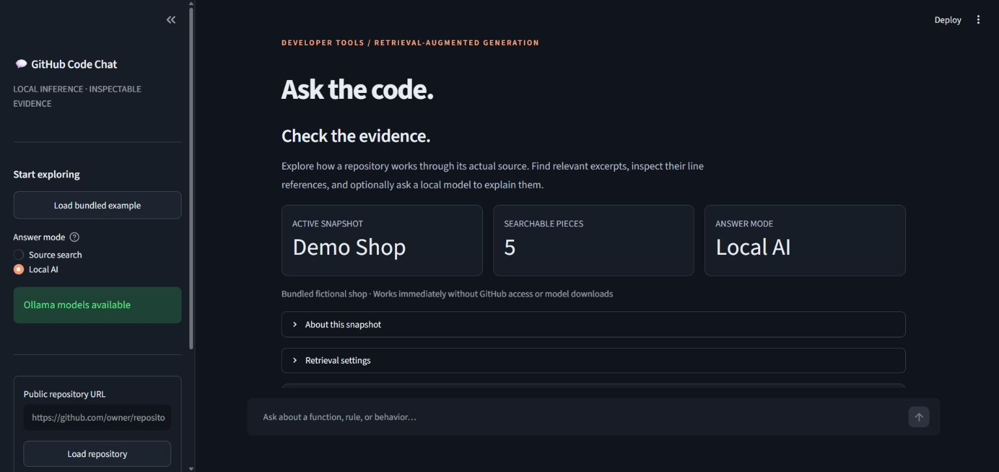

# GitHub Code Chat

An inspectable codebase assistant built by Isaiah Kolawole. Search source excerpts immediately, or use locally hosted Ollama models to generate explanations with source references.

## Try it locally

Python 3.12 is recommended. From the project folder on Windows:

```powershell
./setup.ps1
./start.ps1
```

Open http://localhost:8501. The bundled **Demo Shop** example works immediately: no GitHub token, prebuilt index, model downloads, or Ollama service is required for **Source search**.

On other platforms, or without the Windows Python launcher:

```bash
python -m venv .venv
# Activate the environment using your platform's command.
python -m pip install -r requirements.txt
python -m streamlit run app.py --server.address 127.0.0.1
```



## Two modes

**Source search** uses BM25 keyword ranking and returns inspectable excerpts. It does not generate an AI answer. Try “When is domestic shipping free?” or “How does the shop reject a cart with insufficient stock?”

**Local AI** combines keyword ranking and embedding similarity, then asks a local model to explain the selected excerpts. Install Ollama separately from its official website, start it, and download the models explicitly:

```bash
ollama pull nomic-embed-text
ollama pull llama3.2
```

Select **Local AI**, then **Prepare local AI**. The Windows setup script can also download the models with `./setup.ps1 -WithModels`. No cloud LLM credentials are needed. Model inference stays on the local Ollama service at `127.0.0.1:11434`.

Generated answers can be wrong even when their citations exist. The app checks for missing or out-of-range citation numbers, not factual correctness. Retrieved code remains visible if generation fails. See the [evaluation and known errors](docs/evaluation.md).

## Explore a public repository

1. Enter its root URL, such as `https://github.com/octocat/Hello-World`.
2. Choose **Load repository**. The default branch is resolved to a commit, and GitIngest reads that snapshot as text.
3. Ask a specific question. **Open source** links reference the indexed commit and source lines.
4. Change retrieval settings to compare keyword, vector, and hybrid ranking when embeddings are prepared.
5. Download the conversation and its source excerpts as JSON if useful.

Repository code is never executed. The app accepts public repository roots only. Git must be available on PATH; GitHub's unauthenticated API limits apply. The bundled example is available if GitHub cannot be reached.

Each browser session keeps its active index in memory. Failed ingestion retains the previous index; clearing the chat retains the repository. A page reload may reset the session. The web app does not write user repository indexes to shared `data/` files.

## Architecture

```text
Public GitHub URL → resolve commit → GitIngest → line-based chunks
                                                   ↓
                           BM25 keywords + local embeddings
                                                   ↓
                         reciprocal rank fusion + overlap reduction
                                                   ↓
                   bounded source context → local Llama → citation checks
                                                   ↓
                       explanation + excerpts + source links
```

- Overlapping 40-line chunks preserve 8 lines of boundary context.
- Long excerpts are split into 1,600-character pieces; lockfiles are skipped.
- Ollama is asked not to silently truncate embedding inputs.
- At most 1,200 pieces are supported by this local prototype. Imported files over 100 KB are skipped; extracted text over 3 MB is rejected after ingestion.
- Context is bounded by characters, not exact model tokens.
- Saved CLI indexes include a source fingerprint, model name, schema version and snapshot metadata.

This uses direct Ollama HTTP requests and visible retrieval math rather than a framework or external vector database.

## Terminal workflow

Offline bundled example:

```powershell
./.venv/Scripts/python.exe search_repo.py --sample --lexical "When is domestic shipping free?"
./.venv/Scripts/python.exe search_repo.py --lexical "WELCOME10 coupon"
```

A real repository, with models installed:

```powershell
./.venv/Scripts/python.exe read_repo.py https://github.com/octocat/Hello-World
./.venv/Scripts/python.exe search_repo.py --build
./.venv/Scripts/python.exe search_repo.py "What does the README say?" --answer
```

`read_repo.py` also accepts a user-selected local folder. `chunk_repo.py` remains available for inspecting the line-based chunking step. The CLI stores generated data under ignored `data/`. Old indexes must be rebuilt after upgrading.

## Tests and evaluation

```powershell
./.venv/Scripts/python.exe -m unittest discover -s tests -v
./.venv/Scripts/python.exe evaluate.py
./.venv/Scripts/python.exe evaluate.py --with-models --answers
```

Tests and the keyword evaluation need no models or network. GitHub Actions runs those checks. The optional model evaluation uses the installed local models and records answers for review.

The benchmark contains **20 authored questions on five authored Python files**: 16 answerable and four outside the example's scope. Metrics measure whether the expected file is retrieved, not whether the answer is correct. [Recorded results and limitations](docs/evaluation.md) include observed model mistakes.

## Scope and next steps

This is a local engineering prototype, not a public multi-user inference service. Large repositories, malicious source content, model prompt injection, parsing unusual GitIngest digests and exact token budgets need further work before a hosted deployment. The extraction limits are checked after cloning, so they are not a complete download-resource limit.

Next evaluation should use independently selected real repositories and held-out questions, passage-level relevance judgments, multi-file questions, and separate answer correctness scoring. Function-aware parsing and reranking are useful next experiments.

## Attribution and rollback

Started as a learning project inspired by [AI Engineering Hub's GitHub RAG tutorial](https://github.com/patchy631/ai-engineering-hub/tree/main/github-rag). This implementation calls Ollama directly; it does not use LlamaIndex. The bundled fictional shop corpus is authored for this project.

References: [Ollama API](https://docs.ollama.com/api), [GitIngest](https://github.com/coderamp-labs/gitingest), and [Nomic embedding model](https://huggingface.co/nomic-ai/nomic-embed-text-v1.5).

The version before these improvements is tagged `before-code-chat-improvements-2026-10-02` (`270319a`). Revert the improvement commit to restore it while preserving repository history.
